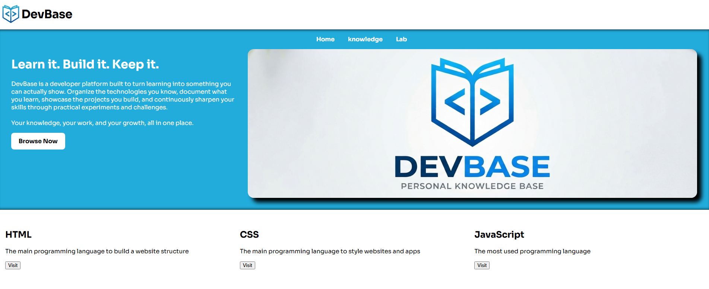

# DevBase

**A personal developer hub for learning, building, and experimenting with software technologies.**

DevBase is a web platform designed to organize technical knowledge, showcase software projects, and provide a space for future coding experiments and interactive tools.

The project is currently under active development and is being built as both a practical learning project and a central place to document my development journey.

## Preview



---

## Overview

DevBase combines three main ideas into one platform:

- **Knowledge Base** — organized technical topics and references for technologies I learn and use.
- **Projects** — a showcase of software and AI projects I have built or am currently developing.
- **Playground** — a planned interactive area for small experiments, demos, and development tools.

Rather than being a traditional portfolio website, DevBase is intended to grow into a personal technical platform that evolves alongside my skills and projects.

---

## Features

### Knowledge Base

The Knowledge Base provides structured sections for different technologies and development topics.

Each technology can include:

- Overview
- Notes and concepts
- Best practices
- Code examples
- References
- Practical usage

Examples of technologies that may be included:

- HTML
- CSS
- JavaScript
- TypeScript
- React
- Python
- FastAPI
- Git
- Docker
- APIs
- Artificial Intelligence

---

### Projects

The Projects section highlights software and AI projects I have worked on.

Each project can include information such as:

- Project overview
- Problem being solved
- Technologies used
- Development status
- Technical architecture
- Screenshots or demonstrations
- Source code availability

The goal is to present projects as real engineering work rather than only displaying project names or screenshots.

---

### Playground

The Playground is a planned feature that will provide a space for small interactive experiments.

Possible future examples include:

- Front-end experiments
- API testing tools
- AI demonstrations
- UI components
- Small developer utilities
- Coding experiments

This section is currently planned for a future version of DevBase.

---

## Tech Stack

The current version of DevBase focuses on core web technologies:

- **HTML5**
- **CSS3**
- **JavaScript**

The project is intentionally being developed from the fundamentals before introducing additional frameworks and technologies.

Future versions may include technologies such as:

- TypeScript
- React
- Backend APIs
- Database integration

---

## Project Goals

DevBase was created with several goals in mind:

1. Strengthen my understanding of modern web development.
2. Apply software engineering concepts through a real project.
3. Build a centralized technical knowledge base.
4. Document and showcase my software and AI projects.
5. Experiment with new technologies in a dedicated environment.
6. Continuously improve the platform as my technical experience grows.

---

## Development Approach

The project is being built incrementally.

Instead of starting with a large framework or complex architecture, the initial versions focus on understanding and implementing the fundamentals correctly.

Key areas of focus include:

- Semantic HTML
- Responsive layouts
- CSS Grid
- Flexbox
- Maintainable CSS structure
- Responsive design
- UI consistency
- Accessibility
- Clean project organization

More advanced technologies will be introduced as the project evolves.

---

## Project Structure

The structure of the project may evolve during development, but the platform is organized around the following main areas:

```text
DevBase
│
├── Home
│
├── Knowledge Base
│   ├── HTML
│   ├── CSS
│   ├── JavaScript
│   └── Other Technologies
│
├── Projects
│
├── Playground
│
└── About
```

---

## Status

> **Active Development**

DevBase is currently under development.

The platform, design, structure, and features will continue to evolve as new technologies and concepts are implemented.

---

## Roadmap

Planned improvements include:

- [ ] Complete the main website structure
- [ ] Build the Knowledge Base system
- [ ] Add dedicated technology pages
- [ ] Add project detail pages
- [ ] Improve responsive behavior
- [ ] Add JavaScript interactions
- [ ] Build the Playground section
- [ ] Introduce TypeScript
- [ ] Explore React integration
- [ ] Add backend functionality where useful
- [ ] Improve accessibility and performance

---

## Why DevBase?

Software development involves constantly learning new technologies, concepts, tools, and patterns.

Instead of keeping that knowledge scattered across notes, repositories, and bookmarks, DevBase aims to bring everything into one structured platform.

It serves as a combination of:

**Knowledge Base + Portfolio + Development Playground**

while also acting as a long-term project that grows with my experience as a developer.

---

## Author

**Mansour Alshamran**

Computer Science graduate focused on:

- Artificial Intelligence
- Software Engineering
- Full-Stack Development
- AI-powered applications

---

## License

This project is currently published for portfolio and demonstration purposes.

Unless explicitly stated otherwise, all rights are reserved.
